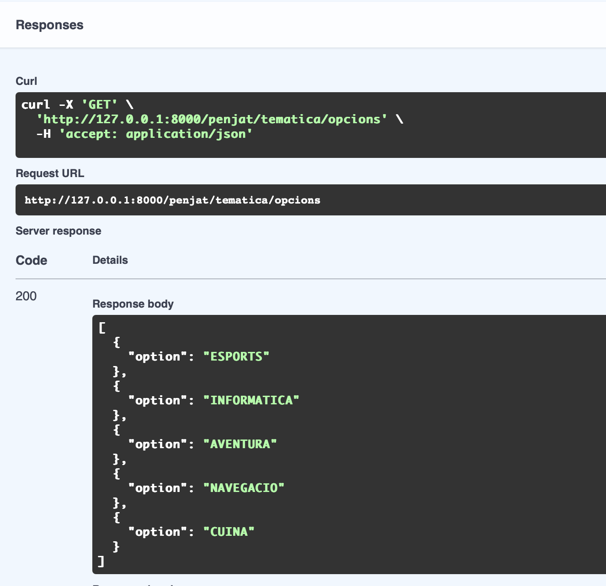
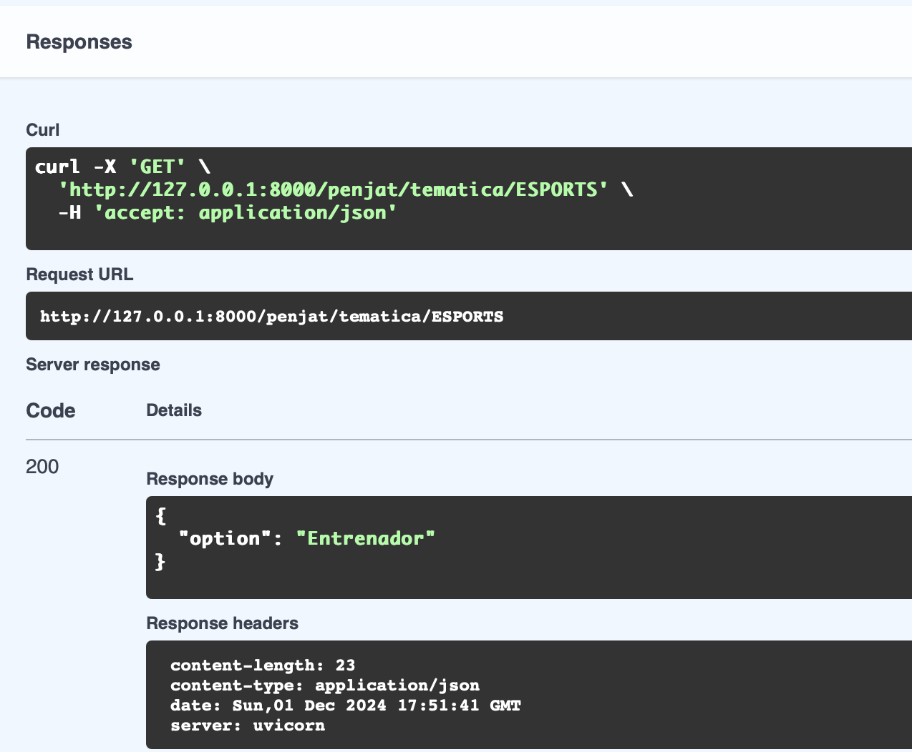

Aquesta imatge conté el punt final /penjat/tematica/opcions que retorna una llista de tots els temes disponibles de la base de dades. La resposta és una llista d'objectes, cadascun amb el nom del tema.

Aquesta imatge conté el punt final /penjat/tematica/{option} que retorna una paraula aleatòria per al tema seleccionat. La resposta és un objecte que conté la paraula aleatòria associada al tema escollit.