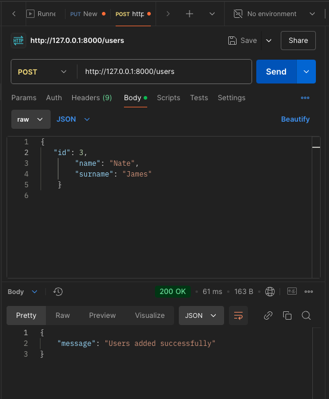
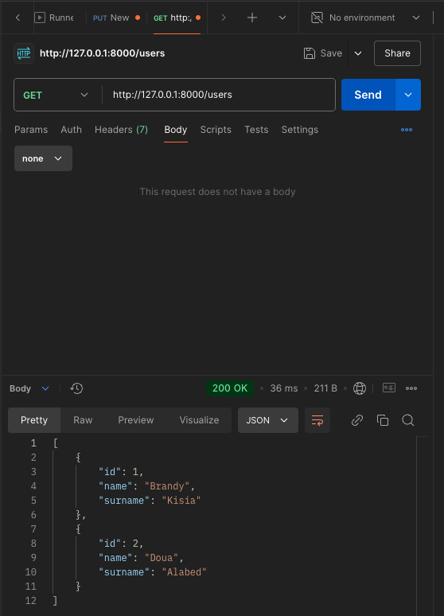

La imatge mostra una sol·licitud PUT correcta a Postman per actualitzar un element.  L'estat de resposta és 200 OK, confirmant que l'element s'ha actualitzat correctament.

La imatge mostra una sol·licitud PUT correcta a Swagger per actualitzar un element.  El cos de la resposta següent confirma que s'ha actualitzat un element amb l'identificador donat

Aquesta imatge mostra una sol·licitud POST feta amb Postman per afegir un usuari nou a la base de dades. La sol·licitud insereix correctament un usuari a la taula Usuaris, confirmant que l'API funciona com s'esperava per afegir nous registres quan s'utilitza el punt final POST /users.

Aquesta imatge mostra una sol·licitud GET feta amb Postman per obtenir dades d'usuari de l'API. La sol·licitud retorna correctament la llista d'usuaris de la taula Usuaris, tal com es mostra al cos de la resposta.

Aquesta imatge mostra la sol·licitud de supressió per eliminar un usuari de la taula mitjançant l'identificador. La sol·licitud s'elimina correctament l'usuari especificat mostrant que l'API funciona correctament.
