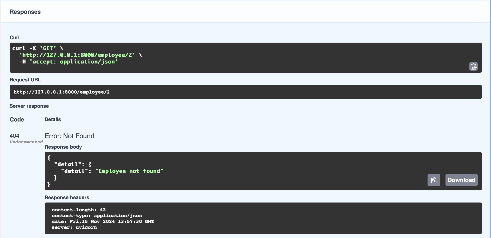

## HTTP GET

## Captura1
Aquestes imatges mostran el mètode GET a Swagger, que retorna un diccionari.

## Captura2
Aquestes imatges mostren els mateixos mètodes GET però a Postman.

## Captura3
Aquesta imatge mostra el mètode GET a Swagger, mostrant una resposta 404 que indica que no s'ha trobat la informació sol·licitada

## Captura4
Aquesta imatge mostra el mètode GET a Postman, mostrant una resposta 404 que indica que no s'ha trobat la informació sol·licitada

## Captura5

Aquesta imatge mostra el mètode GET a Swagger, que mostra una resposta HTTPException que indica que no s'ha trobat la informació sol·licitada.

## captura6

Aquesta imatge mostra el mètode GET a Postman, que mostra una resposta HTTPException que indica que no s'ha trobat la informació sol·licitada.

## HTTP POST

## Captura1

Aquesta imatge mostra el mètode POST a Swagger, demostrant la creació de les dades dels empleats.

## Capture2

Aquesta imatge mostra el mateix mètode POST que l'anterior però a POSTMAN

